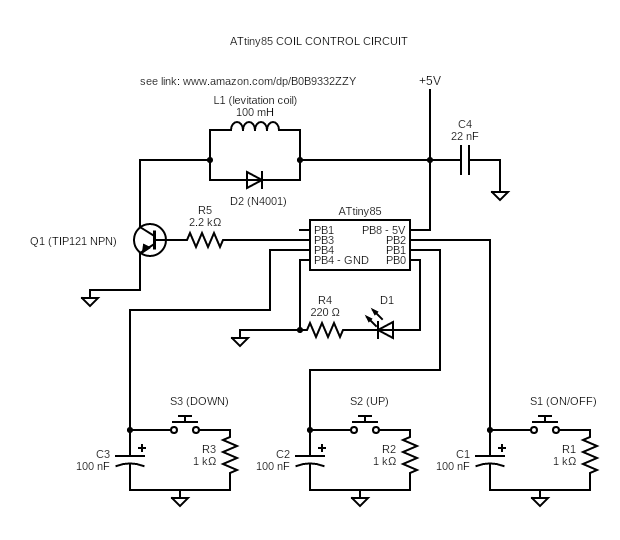

# 23118_windless_windchime

---
This is one of the coolest projects we undertook up to date. It is about transforming an off-the-shelf table top windchime that has a motor fan into a magnetically driven one! The main advantage of this transformation is the fan motor noise will be completely eliminated thereby making the windchime very quiet. Another great thing about the change we add is it brings a certain level of magic into the equation since the windchime appears to be activated without any visible force. Watch our **[watch our construction video using this link][1]** and how the magical operation appears!

Although we worked on a specific type of windchime (bought from a charity store!), the methods can easily be adapted to any windchime that is on a stand. The circuit diagram and the microcontroller code can be used directly without changing anything. You can even adapt and change the code if you like. Experimenting and trying new things is always a good thing!

Following is the working circuit diagram you will need if you want to build this circuit. Notice we have included the coil that you will need in the circuit diagram as well for convenience. If you prefer to use other types of coils, please experiment and pick the one that works best for you.

The circuit has been designed to work with 5V DC and therefore you can power this using an ordinary USB power bank. What this means is you can take your windchime anywhere you like. (The original product required a 6V power supply, which we had to discard as part of the modifications we made)

If you build this project, please share your thoughts and suggestions with the rest of circuitapps community in the comments section of **[our YouTube video][1]**. Also, please feel free to talk about any interesting modifications you make and your experimentations, if any !

## Project Challenges
There are a few things to be careful with while building this project to make sure you get it working after the first attempt

### **Caution 1 - Coil polarity and the magnet**

We added a disc shaped strong magnet to interact with the coil that generates a variable electromagnetic force as controlled by the microcontroller in our circuit (i.e, ATtiny85) You may need to flip the polarity of the coil of the coil does not push the magnet. This is a simple change you may need to make during the testing phase.

### **Caution 2 - Using the three switches**

The original windchime came with a 3-switch module, which we modified and continued using. If you use an ordinary windchime in your project, you will need to add three switches yourself. Alternatively, you may want to discard the switches altogether, which will also work. If you discard the switches, be sure to modify the microcontroller code to skip the power ON/OFF routine.

## Useful tips

### **Tip 1:**
If you have not worked with ATtiny85 before and need support with the basic operation and programming of this device, have a look at this **[excellent reference][2]** that walks you through the entire process step by step. If you get stuck, drop us a message in the comments section of **[our YouTube video][1]**

GOOD LUCK & ENJOY BUILDING THIS COOL PROJECT !

[1]: https://youtube.com/shorts/ZjaUvpx15PA?feature=share

[2]: https://circuitdigest.com/microcontroller-projects/programming-attiny85-microcontroller-ic-using-arduino 
